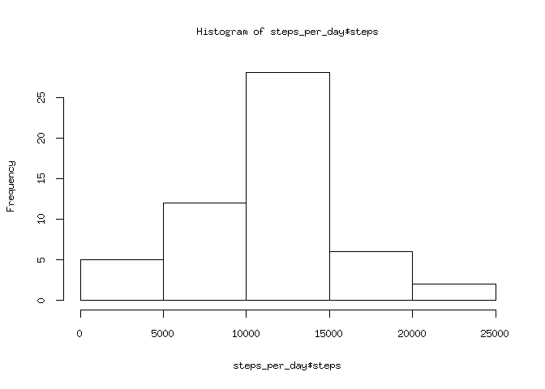
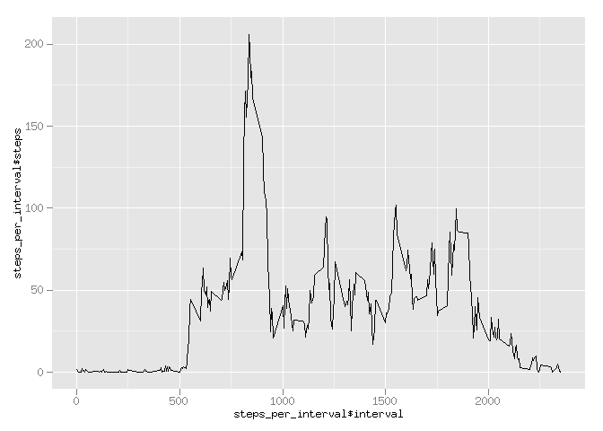
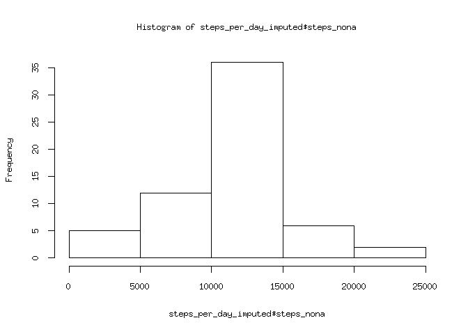
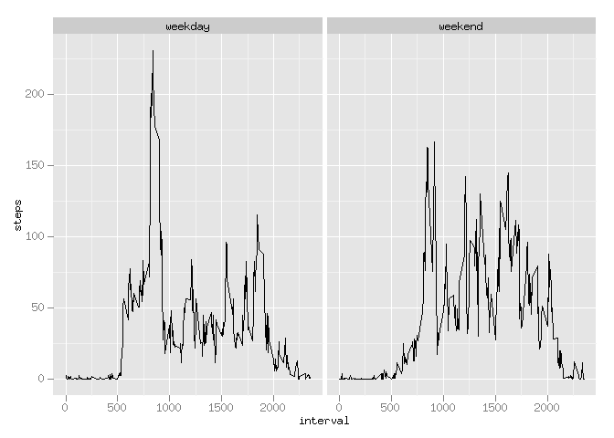

# Reproducible Research: Peer Assessment 1


## Loading and preprocessing the data

Data is first unzipped and then read using standard read.csv function. 
The only preprocessing is converting the date variable to a Date object.


```r
# Open zip archive.
unzip("activity.zip")
# Read data.
activity = read.csv("activity.csv")
# Transform dates from factors to Date-s.
activity$date = as.Date(activity$date)
```

## What is mean total number of steps taken per day?

To calculate the average number of steps per day we need to accumulate the
steps across all intervals in a day.


```r
library(dplyr)
# Compute steps per day.
steps_per_day = activity %>% group_by(date) %>% 
  summarise(steps = sum(steps))
# Mean and median steps per day.
steps_day_mean = mean(steps_per_day$steps, na.rm=TRUE)
steps_day_median = median(steps_per_day$steps, na.rm=TRUE)
```

The mean number of steps per day is 1.0766189\times 10^{4} (ignores NAs).  
The median number of steps per day is 10765 (also ignores NAs).

Below is a histogram of the total number of steps taken each day:


```r
hist(steps_per_day$steps)
```



## What is the average daily activity pattern?

We compute the average number of steps per interval across all days to
illustrate the daily activity pattern.


```r
# Compute average number of steps per interval.
steps_per_interval = activity %>% group_by(interval) %>%
  summarise(steps = mean(steps, na.rm=TRUE))

# Compute interval with most steps.
max_interval = steps_per_interval$interval[which.max(steps_per_interval$steps)]
```

The interval with maximum number of steps is 835.

We graph the pattern using ggplot2.


```r
library(ggplot2)

# Plot average steps per interval.
qplot(steps_per_interval$interval, steps_per_interval$steps, geom="line")
```



## Imputing missing values

To impute missing step values, we iterate over all rows of the data. When we
find an NA, we replace it with the average for the corresponding interval
which we already computed (and graphed) above. The data is added as a new
variable of the data frame called steps_nona.


```r
# Impute NA values.
total_na = sum(is.na(activity))
row_na = 0
for (i in 1:nrow(activity)) {
  if (any(is.na(activity[i,]))) {
    if (!is.na(activity$steps[i])) {
      stop("NA in other than 'steps'")
    }
    row_na <- row_na + 1
    interval = activity$interval[i]
    ind = match(interval, steps_per_interval$interval)
    activity$steps_nona[i] = steps_per_interval$steps[ind]
  }
  else {
    activity$steps_nona[i] = activity$steps[i]
  }
}
total_na
```

```
## [1] 2304
```

```r
row_na
```

```
## [1] 2304
```

The total number of NA values is 2304 and the above code shows these
are all NAs in the steps variable.

The new mean, median, and histogram for the total number of steps per day is
as follows:


```r
# Compute steps per day.
steps_per_day_imputed = activity %>% group_by(date) %>% 
  summarise(steps_nona = sum(steps_nona))
# Mean and median steps per day.
steps_day_mean_imputed = mean(steps_per_day_imputed$steps_nona)
steps_day_median_imputed = median(steps_per_day_imputed$steps_nona)
```
Mean: 1.0766189\times 10^{4}  
Median: 1.0766189\times 10^{4}  
Our strategy preserved the mean from the earlier estimate and moved the median
to be equal to the mean.  
Histogram:

```r
hist(steps_per_day_imputed$steps_nona)
```



## Are there differences in activity patterns between weekdays and weekends?

We classify the days as weekdays or weekends by adding a new factor variable
to the data frame.


```r
# Classify days of week.
for (i in 1:nrow(activity)) {
  day = weekdays(activity$date[i])
  if (day == "Saturday" || day == "Sunday") {
    activity$day[i] = "weekend"
  }
  else {
    activity$day[i] = "weekday"
  }
}
activity$day = factor(activity$day)
```

To analyze the difference between weekdays and weekends we create a panel
plot conditioning on the day.


```r
# Compute average number of steps per interval with imputed data.
steps_per_interval_imputed = activity %>% group_by(interval, day) %>%
  summarise(steps = mean(steps_nona))

# Average steps per interval conditioned on weekday/weekend.
cond_plot = ggplot(steps_per_interval_imputed, aes(interval, steps))
cond_plot +
  geom_line() +
  facet_grid(. ~ day)
```



We see on weekdays there is a spike of activity early in the day whereas on
weekends the activity is more evenly distributed across the day.
